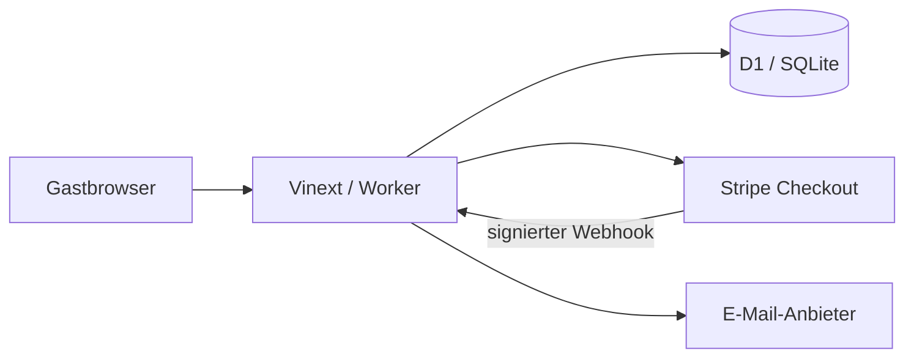

# Architektur

> Dieses Dokument beschreibt die Zielarchitektur. Der verbindliche Ist-Stand steht
> in [CURRENT_STATE.md](CURRENT_STATE.md).

## Überblick

Die App nutzt React/Vinext auf Cloudflare Workers. Strukturierte Daten liegen in
D1 (SQLite). Stripe verarbeitet Karten- und Wallet-Zahlungen; die App speichert
keine Kartendaten.



## Verantwortlichkeiten

- UI: Kalender, Verfügbarkeit, Preis, Formular und Buchungsverwaltung.
- Buchungsservice: Validierung, Preisberechnung, Hold, Konfliktprüfung und Statuswechsel.
- Zahlungsservice: Checkout-Erstellung, Webhook-Verifikation und Rückerstattung.
- D1: autoritative Stellplätze, Buchungen, externe Event-IDs und Audit-Trail.

## Konsistenter Zahlungsablauf

1. In einer Datenbanktransaktion Verfügbarkeit erneut prüfen und einen
   `held`-Datensatz mit kurzer Ablaufzeit anlegen.
2. Stripe Checkout mit interner Buchungs-ID als Metadata erstellen.
3. Bei `checkout.session.completed` Signatur prüfen, Event-ID deduplizieren und
   den Hold atomar auf `confirmed` setzen.
4. Abgelaufene Holds werden ignoriert beziehungsweise als `expired` markiert.
5. Der Erfolgs-Redirect ist nur Anzeige; niemals Zahlungsquelle der Wahrheit.

## Überschneidung

Zeiträume sind halb-offen: `[starts_on, ends_on)`. Ein Datensatz blockiert, wenn
sein Status `held` (und noch nicht abgelaufen) oder `confirmed` ist und gilt:

```text
existing.starts_on < requested.ends_on
AND requested.starts_on < existing.ends_on
```

Die Prüfung und das Erstellen des Holds müssen in derselben serialisierten
Schreiboperation stattfinden. Der zusammengesetzte Index in `db/schema.ts`
unterstützt diese Abfrage.

## Datenmodell

- `parking_spaces`: verwaltbare Stellplätze und Tagespreis.
- `bookings`: Gast, Zeitraum, Preis, Status, Policy-Version und Stripe-Referenzen.
- `payment_events`: verarbeitete Stripe-Event-IDs für Idempotenz.
- `booking_events`: unveränderlicher fachlicher Audit-Trail.

Generierte SQL-Migrationen liegen in `drizzle/` und werden vor dem Merge geprüft.
